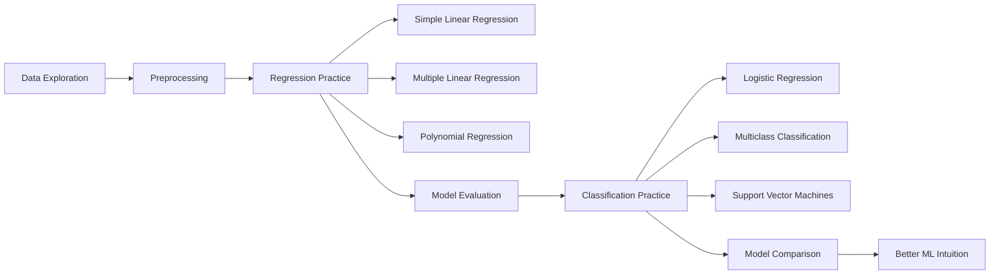

# Machine Learning Practice

This repository contains my hands-on machine learning practice notebooks. The main goal of these exercises is to understand the core workflow of machine learning: exploring datasets, preparing features, training models, evaluating results, and comparing different algorithms.

The notebooks are organized as a progressive learning path, starting with basic regression models and moving toward classification problems with Logistic Regression and Support Vector Machines.

## Learning Flow



This flow shows the general path of the repository: first understanding the data, then preparing it, training regression models, moving into classification tasks, and finally comparing model behavior.


## Topics Covered

- Simple Linear Regression
- Multiple Linear Regression
- Polynomial Regression
- Feature scaling and preprocessing
- Model training and prediction
- Regression model evaluation
- Logistic Regression for binary classification
- Logistic Regression for multiclass classification
- Advanced classification practice
- Support Vector Machine classifiers
- Basic model comparison with LazyPredict

## Repository Structure

| Notebook | Description |
| --- | --- |
| `1-SimpleLinearRegression.ipynb` | Introduction to simple linear regression using study hours data. |
| `2-MultipleLinearRegression.ipynb` | Multiple linear regression practice with grade-related features. |
| `3-PolynomialRegression.ipynb` | Polynomial regression examples and nonlinear relationship modeling. |
| `4-Algerian_forest_fires_FWI_Predict_with_ML.ipynb` | Fire Weather Index prediction using the Algerian forest fires dataset. |
| `5-LazyPredict(Lazım olur).ipynb` | Quick model comparison practice with LazyPredict. |
| `6-LogisticRegressionIntro.ipynb` | Introductory binary classification with logistic regression. |
| `7-LogisticRegressionMultiClass.ipynb` | Multiclass classification practice. |
| `8-LogisticRegressionAdvanced.ipynb` | More advanced logistic regression workflow using fraud detection data. |
| `9-SVMClassifier.ipynb` | Support Vector Machine classification examples. |
| `Lineer Regression Weather Conditions in World War Two/` | A separate regression analysis project using World War Two weather data. |

The repository also includes the CSV datasets used by the notebooks, such as study hours, customer satisfaction, bank customers, cyber attack data, fraud detection, loan risk, email classification, and seismic activity datasets.

## Tools and Libraries

The practice notebooks mainly use Python and common data science libraries:

- pandas
- NumPy
- Matplotlib
- Seaborn
- scikit-learn
- LazyPredict
- Jupyter Notebook

## How to Use

1. Clone or download the repository.
2. Open the project folder in Jupyter Notebook, JupyterLab, VS Code, or another notebook environment.
3. Install the required Python libraries if they are not already installed.
4. Run the notebooks in order to follow the learning path from regression to classification.

Example installation command:

```bash
pip install pandas numpy matplotlib seaborn scikit-learn lazypredict notebook
```

## Purpose

This repository is a learning archive for practicing machine learning fundamentals. It is not focused on production-ready pipelines, but on building intuition through small datasets, experiments, visualizations, and step-by-step model training.

As I continue learning, I may add more notebooks, improve existing explanations, and include additional algorithms or evaluation techniques.
